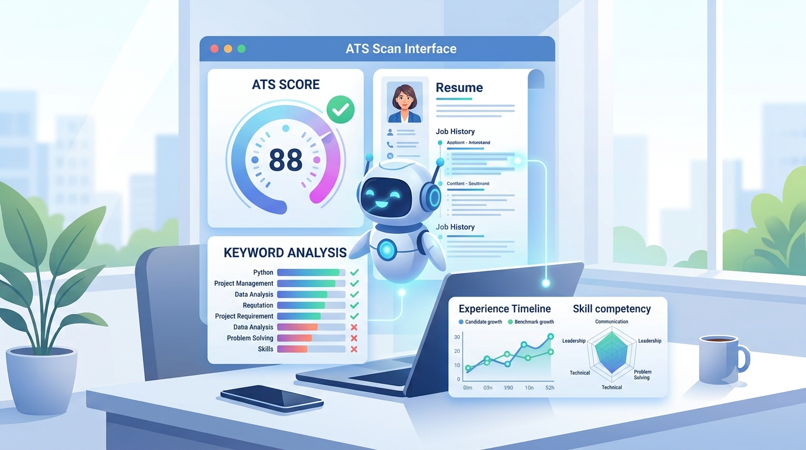
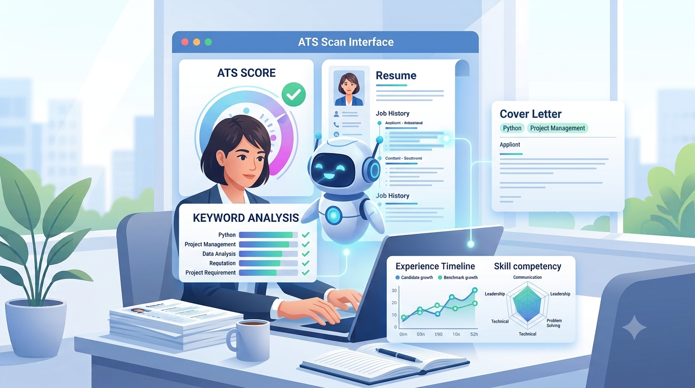
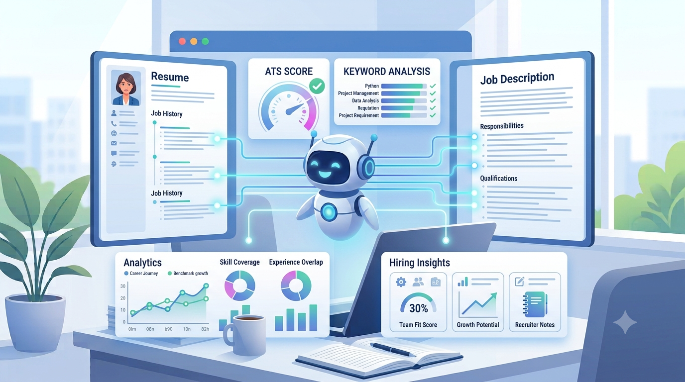

# 🤖 AI Career Assistant

An AI-powered web application that helps students and professionals improve their resumes, evaluate ATS compatibility, and receive career guidance.

---

## 📌 Project Overview

AI Career Assistant is a Streamlit-based application designed to simplify resume analysis and career preparation. It extracts resume content from PDF files, calculates an ATS score, and provides intelligent feedback to help users build stronger resumes.

---


## ✨ Features

- 📄 AI Resume Analyzer
- 🎯 ATS Score Checker
- 💼 AI Cover Letter Generator
- 🎤 Interview Preparation
- 📊 Resume vs Job Description Matching
- 🖼️ Professional UI with Feature Illustrations
- 🤖 AI Career Guidance

---

## 📸 Screenshots

### 🏠 Home


### 📄 Resume Analyzer


### 🎯 ATS Checker



### 💼 Cover Letter Generator



### 🎤 Interview Preparation


### 📊 Resume vs Job Description




## 🛠️ Tech Stack

- Python
- Streamlit
- PDFPlumber
- Git & GitHub

---

## 📂 Project Structure

```
AI-Career-Assistant/
│
├── app.py
├── requirements.txt
├── README.md
├── .gitignore
└── utils/
    └── ats_checker.py
```

---

## 🚀 Installation

Clone the repository:

```bash
git clone https://github.com/Aqsa-Awan-AI/AI-Career-Assistant.git
```

Move into the project directory:

```bash
cd AI-Career-Assistant
```

Install dependencies:

```bash
pip install -r requirements.txt
```

Run the application:

```bash
streamlit run app.py
```

---

## 🎯 Current Progress

- ✅ Resume PDF Upload
- ✅ Resume Text Extraction
- ✅ ATS Score Calculation
- ✅ Resume Statistics
- ✅ Skills Detection
- ✅ Demo AI Resume Analysis

---

## 🔮 Future Improvements

- Gemini AI Integration
- Cover Letter Generator
- Resume vs Job Description Matching
- Interview Question Generator
- Career Roadmap Generator
- Resume Download Feature

---

## 👩‍💻 Author

**Aqsa Awan**

AI & Machine Learning Enthusiast

GitHub:
https://github.com/Aqsa-Awan-AI

LinkedIn:
https://www.linkedin.com/in/aqsa-awan-ai/

---

## ⭐ Support

If you found this project helpful, consider giving it a ⭐ on GitHub.